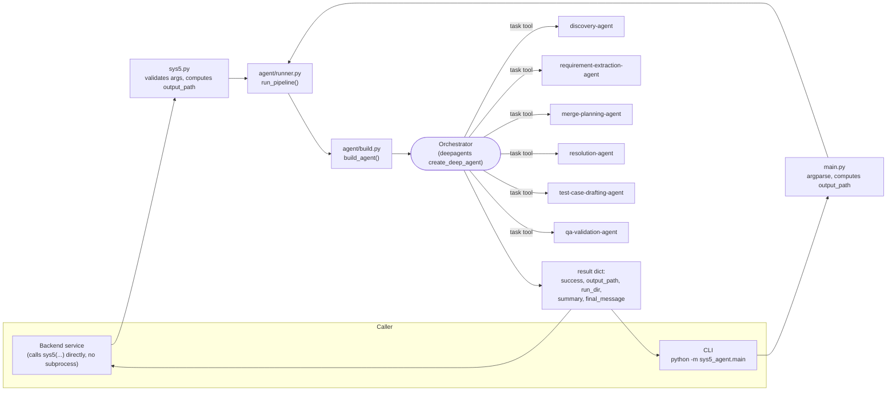
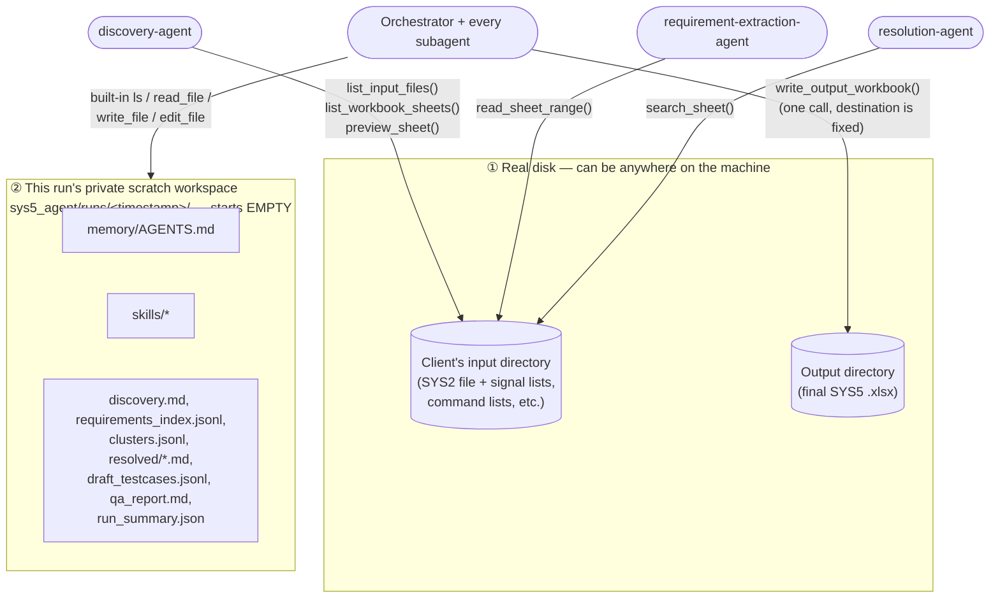
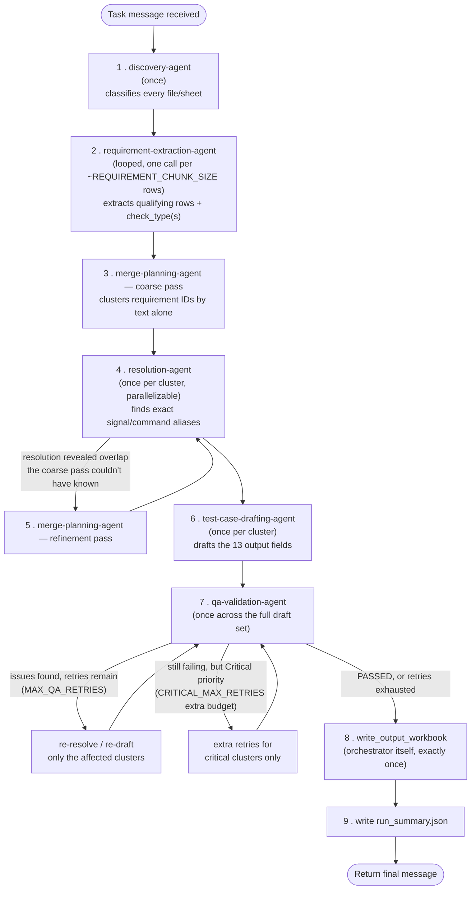
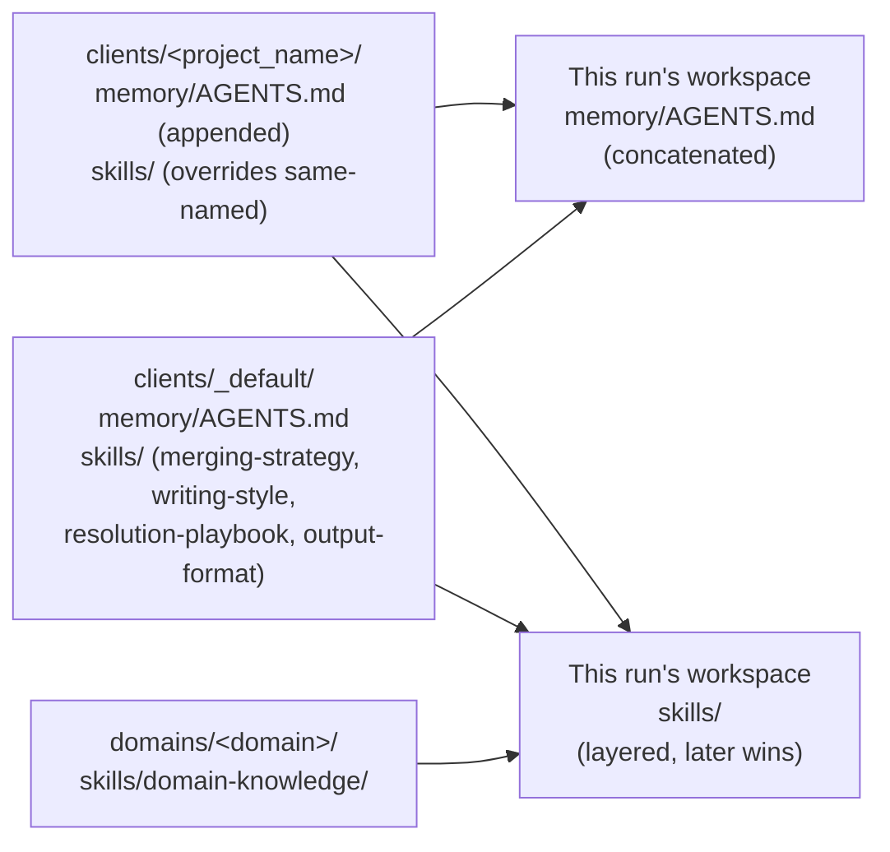

# SYS5 Test Case Generation Agent — Architecture & Developer Guide

This document explains **what this system does, how it's built, and why it's
built that way** — in enough depth that someone who has never used
`deepagents`, and doesn't know what a "subagent" or a "skill" is, can read
the code afterward and understand it.

If you already know `deepagents` cold, skip straight to
[Repository layout](#repository-layout) and [Pipeline flow](#pipeline-flow).

## Table of contents

1. [What this system does](#what-this-system-does)
2. [Concepts glossary (read this first if `deepagents` is new to you)](#concepts-glossary)
3. [Repository layout](#repository-layout)
4. [The big picture](#the-big-picture)
5. [The two filesystems — the most important concept here](#the-two-filesystems)
6. [Request lifecycle, end to end](#request-lifecycle-end-to-end)
7. [The orchestrator](#the-orchestrator)
8. [Pipeline flow](#pipeline-flow)
9. [The six subagents](#the-six-subagents)
10. [The tools](#the-tools)
11. [Skills & memory layering](#skills--memory-layering)
12. [Configuration reference](#configuration-reference)
13. [Context management (why long runs don't blow the model's context)](#context-management)
14. [Run resilience: crashes and premature stops](#run-resilience-crashes-and-premature-stops)
15. [Output-file write safety](#output-file-write-safety)
16. [Sandboxing & safety guarantees, summarized](#sandboxing--safety-guarantees-summarized)
17. [How to run it](#how-to-run-it)
18. [Extending the system](#extending-the-system)
19. [Troubleshooting / FAQ](#troubleshooting--faq)
20. [File-by-file index](#file-by-file-index)

---

## What this system does

Given a **SYS2 System Requirements** Excel workbook (plus whatever
supporting reference workbooks a client provides — signal lists, command
lists, application parameters, communication matrices), this system
produces a **SYS5 System Qualification Test Case** Excel workbook: one row
per test case, with 13 fixed columns (Test Case ID, Feature/Module, Check
Type, Traceability, Test Steps, Expected Result, …).

It does this with an LLM-driven agent, not a hand-written parser, because
the input format is not standardized — file names, sheet names, column
layouts, and even where the "this row needs a test case" marker lives vary
per client. A human test engineer reads the file, figures out what's what,
cross-references signal names against reference sheets, and writes test
cases in a house style. This system automates exactly that judgment-driven
process.

## Concepts glossary

This project is built on [`deepagents`](https://github.com/langchain-ai/deepagents),
a framework for building LLM agents that can plan, delegate, and use tools.
If none of these terms are familiar, read this table before anything else —
every later section assumes you know what these mean.

| Term | Plain-English meaning |
|---|---|
| **Agent** | An LLM in a loop: it gets a prompt + a set of tools, decides which tool to call (if any), sees the tool's result, and repeats until it's done. Both the orchestrator and every subagent in this system are "an agent" in this sense. |
| **Orchestrator** (a.k.a. "main agent") | The one top-level agent the caller talks to. It doesn't do the detailed work itself — it plans the run and **delegates** each phase to a subagent, the way a project lead assigns tasks to specialists rather than doing everything personally. In this repo: `agent/build.py`'s `build_agent()` creates this via `deepagents.create_deep_agent`. |
| **Subagent** | A specialist agent the orchestrator can call via a built-in `task` tool. Each subagent gets **its own separate conversation** (its own context window) — it does its work and returns only a short summary to the orchestrator, instead of the orchestrator seeing every detail of every step. This repo defines 6 of them in `agent/subagents.py` (see [below](#the-six-subagents)). |
| **Why subagents at all?** | An LLM's context window (how much text it can "see" at once) is finite. If the orchestrator itself read every row of a 1000-row requirements sheet, searched every signal list entry, and drafted every test case in its own single conversation, that conversation would grow until it broke. Subagents are the fix: each one burns through a lot of detail in its *own* short-lived conversation, then hands back one paragraph. The orchestrator's own conversation only ever grows by "one paragraph per delegation," not by the full detail of the work. |
| **Tool** | A function the model can choose to call, with a name, a description, and a typed argument schema — the LLM never runs raw code, it emits a structured "call this tool with these arguments" request, and the framework executes the actual Python function. This repo's custom tools live in `tools/excel_tools.py`. |
| **Skill** | A `SKILL.md` file (Markdown, with a `name`/`description` header) that the agent can choose to read on demand, instead of every instruction being crammed into the system prompt permanently. Think of it as a reference manual on a shelf: the agent's system prompt just knows the manual exists and roughly what's in it, and only "opens" (reads) it when that phase of work actually needs it. This keeps the system prompt short and keeps detailed procedures out of every single turn's token budget. |
| **Memory** | A file (`AGENTS.md` in this repo) that, unlike a skill, is loaded into context automatically at the start of every run — for rules that must always apply, not just situationally. |
| **Backend** (in the `deepagents` sense — unrelated to "the backend service" that calls this pipeline) | The storage layer behind the agent's built-in filesystem tools (`ls`, `read_file`, `write_file`, `edit_file`). This repo uses `FilesystemBackend`, which maps those tools onto a real directory on disk. |
| **`virtual_mode`** | A `FilesystemBackend` setting that sandboxes those built-in tools to one root directory: no path the model supplies — absolute, relative, `..`, anything — can ever resolve outside that root. **Critically, this is a *completely separate* filesystem from the client's real input/output directories** — see [The two filesystems](#the-two-filesystems), because mixing the two up is the single most common way this pipeline has failed in practice. |
| **Run workspace** | The one real directory `virtual_mode` is rooted at for a given run: `sys5_agent/runs/<timestamp>/`. It holds this run's copy of memory/skills plus every intermediate file the pipeline produces (`discovery.md`, `requirements_index.jsonl`, etc.) — never the client's actual data. |
| **`task` tool** | The built-in tool the orchestrator uses to invoke a subagent. Calling it starts a fresh conversation for that subagent (system prompt + skills + tools as configured for that subagent), runs it to completion, and returns its final message back to the orchestrator as the tool's result. |
| **Middleware** | A layer `deepagents` wraps around every agent's model calls to add cross-cutting behavior — e.g. the planning/todo tool, filesystem tools, and automatic context summarization are all middleware, added automatically by `create_deep_agent`, not code this repo writes itself. |
| **Context compaction / summarization** | When a conversation grows too large for the model's context window, `deepagents` can automatically replace older messages with a generated summary before the request would otherwise be rejected by the model provider. See [Context management](#context-management) — getting this correctly configured was the fix for a real crash this system hit on long runs. |
| **Model profile** | Metadata a `langchain` chat-model object can carry about itself (e.g. `max_input_tokens`) so framework code like the summarization middleware knows the model's real limits instead of guessing. |

## Repository layout

```
frontend/                        <- dashboard for config + running a generation
├── app.py                        <- FastAPI routes: config, CRUD, upload, generate/status/download
├── builders.py                   <- the only code that writes clients/<name>/ files
├── test_app.py                   <- end-to-end regression test (mocked sys5())
├── web/                          <- the React UI (Vite + Tailwind), served by app.py once built
├── uploads/, outputs/            <- this UI's own scratch space (gitignored)
└── README.md                     <- what it does, how to run it

backend/code/artifacts/SYS5/
├── README.md                    <- this file
├── sys5.py                      <- backend entry point: def sys5(...)
└── sys5_agent/                  <- the agent package itself
    ├── main.py                  <- CLI entry point (argparse wrapper)
    ├── requirements.txt
    ├── agent/
    │   ├── build.py              <- builds one run's agent + workspace
    │   ├── prompts.py            <- orchestrator's system prompt
    │   ├── subagents.py          <- the 6 fixed subagent definitions
    │   ├── custom_subagents.py   <- loads a client's *additional* subagents
    │   └── runner.py             <- shared "run one cycle" logic
    ├── tools/
    │   └── excel_tools.py        <- every tool that touches real .xlsx files
    ├── config/
    │   └── settings.py           <- every tunable value, in one place
    ├── clients/
    │   └── _default/             <- baseline rules loaded for every client
    │       ├── memory/AGENTS.md  <- always-loaded non-negotiable rules
    │       └── skills/           <- merging-strategy, writing-style,
    │                                resolution-playbook, output-format
    │   └── <client-name>/        <- (created per-client, as needed) overrides
    │       ├── memory/AGENTS.md  <- appended on top of the baseline
    │       ├── skills/           <- overrides same-named baseline skills
    │       └── subagents/        <- *additional* subagents for this client
    │                                (see agent/custom_subagents.py)
    ├── domains/
    │   └── <domain>/skills/domain-knowledge/SKILL.md
    │                              <- one per automotive domain: bcm, ivi, ev,
    │                                 powertrain, adas, chassis, telematics
    ├── runs/                     <- per-run private scratch workspaces
    │   └── <timestamp>/          <- created fresh by every run, never reused
    └── output/                  <- CLI's default output location (the
                                     backend always supplies its own instead)
```

**A dashboard, instead of hand-writing files and the CLI:** `frontend/`
(repo root, a sibling of `backend/`) is a small FastAPI app with a form-based
UI for creating/editing/deleting a client's memory rules, skill overrides,
and custom subagents, validating everything against exactly what the
pipeline expects before saving — plus uploading input files and clicking
Generate to run a real `sys5()` cycle in the background, with live progress
and a download link when it's done. See
[`frontend/README.md`](../../../../frontend/README.md). It runs at most one
generation at a time; the CLI/`sys5()` call below is still how a real
backend integration or a scripted/batch run would call this pipeline.

## The big picture



Everything downstream of `run_pipeline()` is the same code path for both
callers — the CLI and the backend's `sys5()` function are both thin
wrappers that validate their own kind of input and then call the exact same
`run_pipeline()`. There is exactly one implementation of the generation
cycle.

## The two filesystems

This is the single most important thing to understand about this codebase,
because confusing the two has been the root cause of more than one real
failure. **There are two completely separate, unrelated filesystems in
play during a run:**



1. **The client's real input/output directories** — real folders on disk,
   which (per the requirement that drove this design) can be *anywhere* on
   the machine. These are reachable **only** through the custom excel
   tools in `tools/excel_tools.py` (`list_input_files`,
   `list_workbook_sheets`, `preview_sheet`, `read_sheet_range`,
   `search_sheet`, `write_output_workbook`). Each tool is built by a
   *factory* that is handed the real directory once, at the start of the
   run, and bakes it in — the model never supplies a directory path to any
   of these tools. See [The tools](#the-tools).

2. **This run's own private scratch workspace** — a directory under
   `sys5_agent/runs/<timestamp>/`, created fresh for every run and never
   reused. This is where the orchestrator's and every subagent's *built-in*
   `deepagents` filesystem tools (`ls`, `read_file`, `write_file`,
   `edit_file`) operate, via a `FilesystemBackend` in `virtual_mode=True`
   (see `agent/build.py`). It holds this run's copy of the memory/skills
   files and every intermediate artifact the pipeline produces. **It never
   contains the client's real files, and it is not the same directory as
   the input/output directories, even when the model is told their real
   paths in plain text.**

Why this matters in practice: the built-in `ls`/`read_file` tools will
happily try *any* path a model gives them — including the literal absolute
path of the real input directory, or a guessed conventional one like
`/workspace/input` — but because they're sandboxed to the run workspace,
they will **always** report "not found," never "here are the client's
files," no matter what path is tried. The only correct way to see the
client's files is the discovery-agent calling `list_input_files()` — which
takes **no path argument at all**, because the real directory is already
baked into the tool. The orchestrator's system prompt (`agent/prompts.py`)
has an explicit section on this exact distinction, because a model
confusing the two is not a hypothetical risk — it's exactly what makes a
run report "no input files found" when the client's files are right there
on disk.

## Request lifecycle, end to end

```mermaid
sequenceDiagram
    participant Caller as Backend / CLI
    participant S5 as sys5.py / main.py
    participant RP as runner.run_pipeline()
    participant BA as build.build_agent()
    participant O as Orchestrator
    participant Sub as Subagents
    participant FS as Real input/output dirs

    Caller->>S5: sys5(domain, project_name, input_folder_path, ...)
    S5->>S5: validate args, compute fixed output_path
    S5->>RP: run_pipeline(client, domain, input_dir, output_path, context_lines)
    RP->>BA: build_agent(client, domain, input_dir, output_path)
    BA->>BA: create run_dir under sys5_agent/runs/
    BA->>BA: write layered memory + copy layered skills into run_dir
    BA->>BA: construct ChatOpenAI with profile={"max_input_tokens": ...}
    BA->>BA: build_read_only_tools(input_dir) + build_write_tool(output_path)
    BA-->>RP: (agent, run_dir)
    RP->>O: agent.invoke(task_message)
    O->>Sub: task(discovery-agent, ...)
    Sub->>FS: list_input_files() / list_workbook_sheets() / preview_sheet()
    Sub-->>O: summary + discovery.md written to run workspace
    O->>Sub: task(requirement-extraction-agent, ...) [looped per chunk]
    Sub->>FS: read_sheet_range()
    Sub-->>O: summary + requirements_index.jsonl appended
    O->>Sub: task(merge-planning-agent, ...)
    Sub-->>O: summary + clusters.jsonl written
    O->>Sub: task(resolution-agent, ...) [per cluster]
    Sub->>FS: search_sheet() / read_sheet_range() / preview_sheet()
    Sub-->>O: summary + resolved/&lt;cluster_id&gt;.md written
    O->>Sub: task(test-case-drafting-agent, ...) [per cluster]
    Sub-->>O: summary + draft_testcases.jsonl appended
    O->>Sub: task(qa-validation-agent, ...)
    Sub-->>O: PASS or N issues + qa_report.md written
    Note over O,Sub: retry loop for flagged clusters (bounded, see settings)
    O->>FS: write_output_workbook(rows) [exactly once]
    O->>O: write run_summary.json to run workspace
    O-->>RP: final orchestrator message
    RP-->>S5: {run_dir, output_path, output_exists, summary, final_message}
    S5-->>Caller: {success, output_path, run_dir, summary, final_message}
```

## The orchestrator

Built in `agent/build.py`'s `build_agent()`, with its system prompt defined
in `agent/prompts.py`. It is deliberately **not** a hardcoded pipeline — its
prompt gives it a *recommended* phase checklist and a set of non-negotiable
rules, but leaves it free to adapt (skip a phase that doesn't apply,
re-order, repeat a phase) using its own planning/todo tool (a `deepagents`
built-in), because real requirements files don't always fit one rigid
shape.

**What the orchestrator itself is allowed to do:**

- Read/write files in **its own run workspace** (built-in tools) — but
  only ever reads there for its own coordination (e.g. reading
  `draft_testcases.jsonl` right before the final write), not preemptively.
- Call `write_output_workbook` — **the only real-file-writing tool it
  holds directly**; every other real-file tool belongs to a subagent.
- Delegate to any of the six subagents via the `task` tool.

**What it must never do:** read an Excel file itself, write test case
content itself, or invent a signal/command/value that a subagent's
resolution phase didn't actually confirm.

**Non-negotiable rules baked into its prompt** (also mirrored in
`clients/_default/memory/AGENTS.md`, which is loaded into every subagent
too):

- Never invent a signal/command/parameter/value — everything must trace
  back to something resolution actually found, referenced by its alias.
- Only rows carrying a qualification marker (see
  `settings.QUALIFICATION_MARKERS`) become test cases.
- Test Steps / Expected Result use only numbered `SET`/`WAIT`/`VERIFY`
  lines, one Expected Result line per Test Steps line.
- Test Precondition / Test Steps / Expected Result use the same fixed
  `1.`/`2.`/`3.` numbering everywhere.
- Every qualifying requirement must be traceable to at least one test
  case; every requirement's check type(s) (`settings.CHECK_TYPES`) are
  classified during extraction.
- Output has exactly 13 fixed columns (`settings.OUTPUT_COLUMNS`), in a
  fixed order.
- Never merge more than `settings.MAX_REQS_PER_TESTCASE` requirements into
  one test case.

## Pipeline flow

This is the *recommended* checklist from `agent/prompts.py` — the
orchestrator can deviate when the data calls for it, but this is the shape
a normal run takes:



A `Critical`-priority test case that still fails QA after **both** retry
budgets are exhausted is not silently dropped — it's written to the output
prefixed `[INCOMPLETE]`/`[FAILED]` in its Objective, with the reason in its
Description, Traceability kept intact, and recorded under a
`critical_failures` list in `run_summary.json`. Non-critical clusters still
failing after `MAX_QA_RETRIES` proceed the same way, without the extra
critical-only retry budget.

## The six subagents

Each subagent is a plain Python `dict` (`name`, `description`,
`system_prompt`, `tools`, `skills`) built by `build_subagents(input_root)`
in `agent/subagents.py`. `description` is what the orchestrator sees when
deciding whether/when to delegate to it; `system_prompt` is that
subagent's own instructions once invoked. Every subagent's prompt ends
with the same instruction (`_RETURN_SUMMARY_ONLY`): persist detail to a
workspace file, return only a short summary — this is what keeps the
orchestrator's own context small no matter how large the input file is.

These six always run, in every client's pipeline, unmodified. A client can
additionally register its own extra subagents alongside them (see
`agent/custom_subagents.py` and [Extending the system](#extending-the-system))
— always purely additive, never a substitute for any of the six below.

| Subagent | Called | Reads (from real input dir) | Writes (to run workspace) | Skills loaded |
|---|---|---|---|---|
| **discovery-agent** | Once, first | Every `.xlsx`/`.xlsm` file, every sheet | `discovery.md` | `domain-knowledge` |
| **requirement-extraction-agent** | Once per row-chunk, looped | One bounded row range of the requirements sheet | `requirements_index.jsonl` (appended) | `domain-knowledge` |
| **merge-planning-agent** | Once (coarse), again if needed (refinement) | `requirements_index.jsonl`, `resolved/*.md` on refinement | `clusters.jsonl` | `merging-strategy`, `domain-knowledge` |
| **resolution-agent** | Once per cluster (parallelizable) | Classified supporting sheets, via `discovery.md` | `resolved/<cluster_id>.md` | `resolution-playbook`, `domain-knowledge` |
| **test-case-drafting-agent** | Once per cluster | `requirements_index.jsonl`, `clusters.jsonl`, `resolved/<cluster_id>.md` (no direct excel access) | `draft_testcases.jsonl` (appended) | `writing-style`, `output-format`, `domain-knowledge` |
| **qa-validation-agent** | Once after all drafting, again after any retry | `draft_testcases.jsonl`, `requirements_index.jsonl`, `clusters.jsonl`, every `resolved/*.md` | `qa_report.md` | `output-format` |

### What each one actually does

- **discovery-agent** — inventories every workbook and classifies each
  sheet: is it the requirements sheet, a signal list, command list,
  compound command list, application parameters, communication matrix, or
  irrelevant? File/sheet names are *not* standardized across clients, so
  it verifies by previewing actual content, never by name-matching alone.
  It records the exact `file_name` string (from `list_input_files`) for
  every file/sheet it classifies — every later phase looks that file up by
  reusing that exact string, never a reconstructed path.

- **requirement-extraction-agent** — reads one bounded row range (never a
  whole large sheet at once) and pulls out only rows that carry a
  qualification marker (case-insensitive, checked anywhere in the row —
  every populated cell, not one assumed column), preferring to treat a
  close variant of the marker wording as qualifying rather than silently
  excluding it. For each, it derives a stable requirement ID, records the
  requirement text/feature/variant/traceability, and classifies it against
  the five fixed check types (a requirement can get more than one). Its
  summary explicitly echoes the row range it was asked to cover against the
  range it actually covered, and the sheet's total row count
  (`sheet_max_row`) — this is what lets the orchestrator (and QA) tell a
  chunk that stopped short from one that genuinely found nothing.

- **merge-planning-agent** — groups requirement IDs into clusters, one
  cluster per eventual test case, per the `merging-strategy` skill's
  rules. A cluster has exactly one check type by default — a requirement
  tagged with several check types lands in one cluster per applicable
  type. Runs a **coarse pass** (text alone) before resolution, and
  optionally a **refinement pass** afterward if resolution reveals overlap
  the text alone couldn't show.

- **resolution-agent** — for one cluster, searches the classified
  supporting sheets to find the *exact, verbatim* signal/command/parameter
  names and values the requirement text refers to. Never invents or
  approximates a name; anything it can't find after a bounded number of
  attempts is recorded as `unresolved` rather than guessed. Records both
  the short **alias** (what drafting will actually use) and the raw
  ID/address (kept for traceability only).

- **test-case-drafting-agent** — for one already-resolved cluster, drafts
  the 13 output-format fields in the client's writing style. Works
  entirely from what extraction/resolution already recorded — it has no
  excel tools of its own, so it structurally cannot introduce a
  signal/command that wasn't actually resolved.

- **qa-validation-agent** — cross-checks the *entire* draft set at once:
  traceability coverage, anti-hallucination (every referenced alias
  actually exists in that cluster's resolution), structural completeness
  (all 13 columns non-empty, valid check types, consistent numbering, one
  Expected Result line per Test Steps line, the fixed `=`/`==` operators —
  never a comma or "to"/"is"/"equals" standing in for either), and
  extraction coverage — cross-referencing discovery.md's recorded row
  count for the requirements sheet against `requirements_index.jsonl` to
  catch a chunk that silently stopped short rather than assuming the rest
  of the sheet simply had nothing else to qualify. (Test Case ID format/
  uniqueness isn't QA's concern — `write_output_workbook` assigns it
  unconditionally at write time, see [The tools](#the-tools).) Reports PASS
  or a list of issues grouped by `cluster_id` (plus any coverage gap, noted
  separately) for the orchestrator to target with retries.

## The tools

All in `tools/excel_tools.py`. These are the *only* tools that ever touch a
real file — deliberately dumb and deterministic (no domain reasoning, no
"which sheet is the requirements sheet" guessing): every judgment call is
left to the calling agent.

### Sandboxing model

Both tool-building functions are **factories** — called once per run, each
closing over a fixed real path, so the resulting tools physically cannot
be pointed anywhere else:

```python
# agent/subagents.py
list_input_files, list_workbook_sheets, preview_sheet, read_sheet_range, search_sheet = \
    build_read_only_tools(input_root)   # bound to this run's real input directory

# agent/build.py
write_output_workbook = build_write_tool(output_path)  # bound to this run's real output file
```

Every read-only tool takes a bare **`file_name`** (never a path) —
`list_input_files()` takes no arguments at all. This is a deliberate
design choice, not an oversight: the input directory is already fixed per
run, so there's nothing for the model to look up, and nothing for it to
get wrong. An earlier version required a `file_path` combining "input_dir
+ file name," which asked the model to reconstruct a path it wasn't
equipped to reconstruct correctly (especially across OS path-separator
conventions) — that mismatch is exactly what used to make a Windows-style
path show up mangled in a downstream "no such file or directory" error.
`_resolve_within()` still refuses anything that resolves outside the
bound root (rejecting `..` traversal, escaping symlinks, etc.), and falls
back to just the final path segment if a model hands back something
path-like anyway, so a stray value degrades gracefully instead of failing
outright.

### The read-only tools

| Tool | Arguments | What it does |
|---|---|---|
| `list_input_files()` | *(none)* | Lists every `.xlsx`/`.xlsm` file directly in this run's input directory: `{"file_name", "size_bytes"}`. |
| `list_workbook_sheets(file_name)` | bare file name | Lists every sheet in that workbook with its used dimensions: `{"sheet_name", "max_row", "max_col"}`. |
| `preview_sheet(file_name, sheet_name, n_rows=None)` | | Previews the first N rows, cells keyed by column letter — for classifying an unknown sheet or finding where headers actually start. |
| `read_sheet_range(file_name, sheet_name, start_row, end_row, columns=None)` | | Reads a bounded row range (capped server-side by `MAX_ROWS_PER_READ`) — the only way large sheets get read, always in chunks. |
| `search_sheet(file_name, sheet_name, query, columns=None, regex=False, max_results=None)` | | Searches for rows containing a query string without reading the whole sheet — how resolution finds a signal/command without scanning 500 rows by hand. |

All three of the row-reading tools (`preview_sheet`, `read_sheet_range`,
`search_sheet`) derive each returned row's number and each cell's column
letter from `enumerate()` over the known range/position — **not** from the
cell object's own `.row`/`.column` attributes. This matters because
`openpyxl`'s read-only mode represents a blank cell as an `EmptyCell`
placeholder that has *neither* attribute: code that trusted a cell's own
position used to crash outright on any row containing a blank cell, and
silently report a row number of `null` whenever the first cell in a row
(column A) happened to be blank. `enumerate()` sidesteps this entirely by
never asking a cell what its own position is.

`list_workbook_sheets` and `read_sheet_range` also `print()` what they find
— a sheet's total row count the moment it's known, and each chunk read
against that total (`rows 41-80 of 404 total`) — directly to the terminal,
independent of the `ProgressLogger` callback (see
[Context management](#context-management)/progress logging above). This is
what tells you, live, how many rows a long extraction pass actually has to
get through. `read_sheet_range`'s JSON response also carries this as
`sheet_max_row`, so the requirement-extraction-agent itself can reason
about how much of the sheet it still has left to cover, not just a human
watching the terminal.

### The write tool

`write_output_workbook(rows)` — bound to exactly one output file (fixed at
build time, no path argument, so there's nothing to misuse), it enforces
the fixed 13-column template (`settings.OUTPUT_COLUMNS`) regardless of
what keys the caller used, applies cosmetic formatting (styled header,
column widths by field type, wrapped body text, zebra striping, borders,
autofilter), and writes exactly one sheet. See
[Output-file write safety](#output-file-write-safety) for how it protects
against a corrupt/partial save being mistaken for success.

It also unconditionally assigns **Test Case ID** itself —
`f"{settings.TEST_CASE_ID_PREFIX}{n}"` (`TC_SYS_1`, `TC_SYS_2`, ... by
default) in final row order — overwriting whatever value the caller
supplied for that column. This is deliberate: it's the one place in the
pipeline that can actually guarantee both a fixed format and uniqueness
across the whole file in one step, rather than hoping every drafting call
(each running in its own isolated cluster, sometimes in parallel with
others with no visibility into each other's numbering) independently
avoids colliding. Nothing else in the pipeline keys off Test Case ID —
Traceability tracks requirement IDs, resolution/QA key off `cluster_id` —
so overwriting it here has no downstream effect to account for.

## Skills & memory layering



Before an agent is built, `agent/build.py` resolves and **copies** (never
references in place) the layered memory/skills into a fresh directory
under this run's own workspace:

1. **Baseline** (`clients/_default/`) — always loaded. Its `memory/AGENTS.md`
   carries the non-negotiable rules that apply to every client; its
   `skills/` directory carries the four skills every run needs:
   `merging-strategy`, `writing-style`, `resolution-playbook`,
   `output-format`.
2. **Domain** (`domains/<domain>/skills/domain-knowledge/`) — layered on
   top; fixed for the whole run (`--domain`/`domain` argument), carrying
   that automotive domain's typical ECUs/modules, signal/command naming
   conventions, vehicle networks, common requirement/test patterns, and
   terminology pitfalls (one file per domain: `bcm`, `ivi`, `ev`,
   `powertrain`, `adas`, `chassis`, `telematics`).
3. **Client** (`clients/<project_name>/`) — layered on top of both, if
   that directory exists; a project with no such directory yet still runs
   fine on baseline rules alone. A client skill overrides a same-named
   baseline/domain skill; its `memory/AGENTS.md` (if present) is appended
   after the baseline's.

This copy-rather-than-reference approach means each run is a
**self-contained, reproducible snapshot** of the rules actually in effect
— editing a client's directory later never retroactively changes a
past run's record of what rules it followed.

### The four baseline skills, in one line each

- **`merging-strategy`** — when to collapse several requirements into one
  test case vs. keep them separate; check type is a clustering dimension
  (one cluster = one check type, by default); two-pass process (coarse,
  then refinement after resolution).
- **`resolution-playbook`** — how to search supporting documents for
  exact signal/command/parameter names; bounded search-and-give-up
  procedure; record alias *and* raw ID separately.
- **`writing-style`** — phrasing/tense/terminology conventions; the fixed
  `1.`/`2.`/`3.` numbering scheme; the mandatory `SET`/`WAIT`/`VERIFY`
  syntax with its fixed `=` (assignment) / `==` (comparison) operators;
  check-type-driven wording (what a Boundary Value Check test case's steps
  should look like vs. a Stress Test's).
- **`output-format`** — the canonical definition of all 13 output columns
  and what "structurally complete" means for each, including the fixed
  `TC_SYS_<n>` Test Case ID format (assigned automatically, not something
  drafting needs to get right), the alias-only anti-hallucination rule, and
  how an unrecoverable `Critical` item gets marked `[INCOMPLETE]`/`[FAILED]`
  instead of silently dropped.

## Configuration reference

Everything tunable lives in `config/settings.py` — nothing outside that
file should hardcode a model name, path, threshold, or column list. Every
value is overridable via an environment variable.

| Setting | Env var | Default | Meaning |
|---|---|---|---|
| `LLM_MODEL` | `SYS5_LLM_MODEL` | `qwen-3.6-32b` | Model name passed to the OpenAI-compatible endpoint. |
| `LLM_API_KEY` | `SYS5_LLM_API_KEY` | `not-needed` | API key for that endpoint (self-hosted endpoints often don't check it). |
| `LLM_BASE_URL` | `SYS5_LLM_BASE_URL` | `http://localhost:8000/v1` | The OpenAI-compatible endpoint URL. |
| `LLM_TEMPERATURE` | `SYS5_LLM_TEMPERATURE` | `0.1` | Sampling temperature. |
| `LLM_CONTEXT_TOKENS` | `SYS5_LLM_CONTEXT_TOKENS` | `100000` | The endpoint's **real** total context window — critical to set correctly; see [Context management](#context-management). |
| `MAX_AUTO_CONTINUE_TURNS` | `SYS5_MAX_AUTO_CONTINUE_TURNS` | `8` | How many times to nudge-and-retry a run that stopped without writing `run_summary.json`, before giving up; see [Run resilience](#run-resilience-crashes-and-premature-stops). |
| `REQUIREMENT_CHUNK_SIZE` | `SYS5_REQUIREMENT_CHUNK_SIZE` | `40` | Rows per `requirement-extraction-agent` call. |
| `MAX_REQS_PER_TESTCASE` | `SYS5_MAX_REQS_PER_TESTCASE` | `6` | Hard cap on requirements merged into one test case. |
| `MAX_RESOLUTION_ATTEMPTS` | `SYS5_MAX_RESOLUTION_ATTEMPTS` | `5` | Bounded search attempts before marking an item `unresolved`. |
| `MAX_QA_RETRIES` | `SYS5_MAX_QA_RETRIES` | `2` | General QA re-draft/re-resolve retry budget. |
| `CRITICAL_MAX_RETRIES` | `SYS5_CRITICAL_MAX_RETRIES` | `3` | *Extra* retry budget for `Critical`-priority items still failing after the general budget. |
| `SHEET_PREVIEW_ROWS` | `SYS5_SHEET_PREVIEW_ROWS` | `5` | Rows returned by `preview_sheet` by default. |
| `MAX_ROWS_PER_READ` | `SYS5_MAX_ROWS_PER_READ` | `200` | Server-side cap per `read_sheet_range` call. |
| `MAX_SEARCH_RESULTS` | `SYS5_MAX_SEARCH_RESULTS` | `50` | Cap on matches returned by `search_sheet`. |
| `QUALIFICATION_MARKERS` | *(code only)* | `["sys qualification test", "sys5 test", "system qualification test"]` | Case-insensitive substrings marking a row as needing a test case; extend per-client via that client's `AGENTS.md`. |
| `CHECK_TYPES` | *(code only)* | `Boundary Value Check`, `Invalid Values Check`, `Functionality Check`, `Stress Test`, `Load Test` | The fixed classification set every qualifying requirement is checked against. |
| `OUTPUT_COLUMNS` | *(code only)* | 13 fixed column names | The output template — never renamed/reordered/added/removed. |
| `OUTPUT_SHEET_NAME` | *(code only)* | `SYS5_Test_Cases` | Name of the single sheet in the output workbook. |
| `TEST_CASE_ID_PREFIX` | *(code only)* | `TC_SYS_` | Prefix `write_output_workbook` uses when assigning `f"{prefix}{n}"` as every row's Test Case ID, in final row order — see [The tools](#the-tools). |
| `SUPPORTED_OUTPUT_FORMATS` | *(code only)* | `["xlsx"]` | Whitelist of formats the write tool can actually produce. |
| `DEBUG` | `SYS5_DEBUG` | `0` | Verbose `deepagents` debug output when `"1"`. |

`DOMAINS`, `DOMAIN_LABELS`, `DOMAIN_ALIASES`, `CLIENTS_DIR`, `RUNS_DIR`,
`OUTPUT_DIR` and the `client_dir()`/`domain_dir()`/`normalize_domain()`
helper functions are also defined here — see the file directly for their
exact behavior, including the path-traversal guard (`validate_safe_name`)
that rejects a `project_name`/`domain` containing `/` or `..` before it
ever reaches a `Path` join.

## Context management

**Why this section exists:** a run processing a real ~50-requirement input
once died mid-run with the model provider rejecting a **117,139-token**
request against its actual **100,000-token** limit — after discovery and
clustering had already completed successfully. This section explains why,
because the fix depends on understanding a `deepagents` internal that
isn't obvious from this repo's code alone.

`create_deep_agent` automatically attaches a `SummarizationMiddleware` to
every agent (orchestrator and subagents alike) that compacts the
conversation — replacing older messages with a generated summary — before
it would otherwise exceed the model's context window. **The threshold for
when to do this is computed from the model object's own `.profile`
attribute**, specifically `profile["max_input_tokens"]`. If that's not
set, `deepagents` has no idea what the real limit is and falls back to a
fixed **170,000-token** trigger, on the theory that's a conservative
number for well-known hosted models.

`langchain_openai.ChatOpenAI` auto-populates `.profile` from a built-in
registry of well-known OpenAI model names — but a self-hosted,
OpenAI-compatible model like `qwen-3.6-32b` has no entry in that registry,
so `.profile` stayed `None`. The 170k fallback trigger is *larger* than
this particular endpoint's real 100k limit, so the conversation was free
to keep growing well past what the server would actually accept, with
compaction never kicking in early enough to prevent the crash.

The fix, in `agent/build.py`:

```python
llm = ChatOpenAI(
    model=settings.LLM_MODEL,
    ...,
    profile={"max_input_tokens": settings.LLM_CONTEXT_TOKENS},
)
```

`BaseChatModel.profile` is a plain field that, once explicitly supplied,
is *not* overwritten by the auto-detection logic — so this makes
`deepagents` use the correct, **fraction-based** default instead
(compact at 85% of the real window, keep the most recent 10%).

**What this means for you operationally:** `settings.LLM_CONTEXT_TOKENS`
(env var `SYS5_LLM_CONTEXT_TOKENS`) must be set to whatever your actual
endpoint's context window really is. Under-reporting it just triggers
compaction a bit earlier than strictly necessary (harmless). Over-reporting
it reintroduces this exact failure — the conversation grows past what the
server will actually accept before compaction ever triggers.

Subagents don't need a separate fix: none of them override `model` in
their subagent definition, so they all resolve to this same `llm` object
and inherit its `.profile` automatically.

## Run resilience: crashes and premature stops

A `deepagents`/LangGraph agent's loop works like this: the model responds,
and if that response includes a tool call, the loop runs the tool and
feeds the result back in; the loop only stops once a response comes back
with **no** tool call in it. Two different things can end a run before
`run_summary.json` actually exists, and `runner.run_pipeline` handles them
differently:

**1. A hard crash** (an exception raised somewhere in `agent.invoke(...)`)
— e.g. a bug inside `deepagents` itself: its `FilesystemBackend` raises a
bare `ValueError("Path traversal not allowed")` for a `..` in a path
handed to `ls`/`read_file`/etc., but its own error handling only catches
`OSError`/`RuntimeError` around that call, so it propagates uncaught.
`run_pipeline` wraps the whole `agent.invoke(...)` call in a broad
`try/except`: on any exception, the run is reported as a normal generation
failure (in the returned dict, `final_message` carrying the error) rather
than crashing whatever process called `sys5()`/the CLI. This is *not*
retried automatically — re-invoking into whatever just broke is more
likely to repeat the failure than fix it.

**2. A premature stop with no crash at all** — the model simply replies
with a conversational status update ("discovery is done, extraction is in
progress, I'll keep you updated...") instead of continuing to delegate.
Nothing raises; from LangGraph's point of view the run finished normally.
This is a real failure mode a smaller/self-hosted model can hit,
especially after a long subagent call. `run_pipeline` detects it precisely:
the orchestrator's own prompt defines "done" as "`run_summary.json` exists"
(step 10 of its checklist), so if `agent.invoke(...)` returns *without*
that file existing, the run isn't actually finished no matter what the
last message said.

To recover from case 2, `build_agent` gives the agent an in-memory
LangGraph checkpointer (`InMemorySaver`), keyed by `thread_id=run_dir.name`
— this is what makes sending a *second* message on the same thread
continue the exact same conversation (full history: what discovery found,
which chunks extraction already processed, everything) instead of starting
over. `run_pipeline` uses this to automatically send a short "you stopped
without finishing, continue exactly where you left off" nudge and
re-invoke, up to `settings.MAX_AUTO_CONTINUE_TURNS` (default `8`, env
`SYS5_MAX_AUTO_CONTINUE_TURNS`) times, before giving up and reporting the
run as genuinely incomplete. The orchestrator's prompt also states this
rule directly ("this run is not done until run_summary.json exists, never
end a turn with a status update instead of the next action") so relying on
the nudge is the fallback, not the primary mechanism.

**What this does *not* cover:** the checkpointer is in-memory, so it only
helps within one `run_pipeline()` call in one running process. If the
Python process itself is killed (not just the model stopping early), that
conversation state is gone -- `build_agent` always starts a fresh
`sys5_agent/runs/<timestamp>/` workspace with no way to resume a
previous, separate process's run today. That would need a *persistent*
checkpointer (e.g. writing to a SQLite file inside `run_dir` instead of
memory) and a way to pass an existing `run_dir` back in to resume against
-- a bigger, deliberate feature, not something that falls out of the
in-memory fix above.

## Output-file write safety

**Why this section exists:** roughly 1 run in 5 used to report a
successful save when the real output workbook either didn't exist or was
corrupt. Two independent gaps caused this, both now closed:

**1. `write_output_workbook` no longer writes directly to the final
path.** It now:

1. Builds the workbook in memory as before.
2. Saves it to a **temp file in the same directory** (same filesystem,
   which is what makes the next step atomic) — named
   `.{stem}.{random-hex}{suffix}` so it can never collide with a real
   output file or another run.
3. **Re-opens that temp file and verifies** it actually has the expected
   number of rows.
4. Only then calls `os.replace(tmp_path, out)` — an atomic rename that
   either fully succeeds or leaves the original destination completely
   untouched; there is no window where a half-written file could sit at
   the real path.
5. On *any* exception at any of these steps, the temp file is deleted and
   the tool returns `{"error": "..."}` — never a raised exception, so the
   orchestrator sees a clear, structured failure it can act on (retry, or
   report honestly) instead of an opaque crash.

Previously, `wb.save(out)` wrote straight to the final destination. A
mid-save failure (a synced/locked destination folder, the file still open
in Excel, a disk hiccup) could leave a truncated or corrupt file sitting
exactly at `output_path` — which still satisfies a plain `is_file()`
check.

**2. `run_pipeline()` no longer trusts a bare `is_file()` check.** It now
records the output file's modification time (or its absence) *before* the
agent runs, and only reports success if the file exists **and** its mtime
actually changed during this run:

```python
pre_run_mtime = output_path.stat().st_mtime if output_path.exists() else None
...
output_written_this_run = output_path.is_file() and (
    pre_run_mtime is None or output_path.stat().st_mtime != pre_run_mtime
)
```

This closes a second, independent gap: a stale file already sitting at
the same computed path (e.g. a rerun of the same `project_name` +
`current_version`, where the model never got as far as actually writing
this time) can no longer be mistaken for this run's own success.

**3. The orchestrator's prompt now says explicitly** to check
`write_output_workbook`'s own result for an `"error"` key rather than
assuming success once the call returns, retry once on error, and if it
fails again, report the failure plainly rather than claiming the workbook
was saved.

## Sandboxing & safety guarantees, summarized

- **Real-file access is closure-bound, not convention-bound.** Every tool
  that touches a real file was built by a factory handed exactly one real
  path at construction time; there is no code path by which a tool
  returned by `build_read_only_tools(input_dir)` could ever touch a
  different directory, regardless of what the model requests.
- **`_resolve_within()`** additionally guards every read-only tool call
  against path traversal (`..`) and symlinks that point outside the bound
  root, on top of the closure-binding above.
- **The write tool has no path argument at all** — the destination is
  fixed at build time; there is nothing for the model to get wrong.
- **The run workspace (`virtual_mode` sandbox) is a second, independent
  layer** — it protects the orchestrator/subagents' own scratch files
  (memory, skills, intermediates) from `..`/absolute-path escapes, but is
  a *completely different filesystem* from the real input/output dirs (see
  [The two filesystems](#the-two-filesystems)).
- **`project_name`/`domain` are validated against a safe-name pattern**
  (`validate_safe_name` in `settings.py`) before ever being joined onto
  `CLIENTS_DIR`/`DOMAINS_DIR`, rejecting anything containing a path
  separator or `..`.
- **A failed output save can never corrupt or fake a prior result** — see
  [Output-file write safety](#output-file-write-safety).

## How to run it

### As the backend

```python
from backend.code.artifacts.SYS5.sys5 import sys5

result = sys5(
    domain="bcm",
    output_format="xlsx",
    project_name="acme",
    username="jdoe",
    current_version="v3",
    input_folder_path="/any/path/on/disk/acme_inputs",
    output_folder_path="/any/other/path/acme_outputs",
    requirement_filename="SYS2_Requirements.xlsx",
)
# result = {"success": bool, "output_path": str, "run_dir": str,
#           "summary": dict | None, "final_message": str | None}
```

`input_folder_path`/`output_folder_path` can be anywhere on disk — nothing
about this pipeline assumes a fixed location for either; `output_folder_path`
is created if it doesn't already exist.

### From the CLI

```bash
python -m sys5_agent.main \
    --client acme \
    --domain bcm \
    --input-dir /any/path/on/disk/acme_inputs \
    --requirements-file SYS2_Requirements.xlsx \
    [--output-path output/acme_SYS5.xlsx]
```

Both paths funnel into the exact same `run_pipeline()` — see
[Request lifecycle](#request-lifecycle-end-to-end).

## Extending the system

**Add a new automotive domain:** create
`domains/<name>/skills/domain-knowledge/SKILL.md` (copy an existing one's
frontmatter shape — `name: domain-knowledge`, a `description` explaining
what it covers), then add the domain key to `settings.DOMAINS` (and a
label to `settings.DOMAIN_LABELS`). It's picked up automatically the next
run that passes `--domain <name>`.

**Add a client-specific override:** create `clients/<project_name>/`. An
`memory/AGENTS.md` there is appended after the baseline rules; a
`skills/<name>/SKILL.md` there overrides the same-named baseline (or
domain) skill for that client only. A project with no such directory yet
still runs fine on baseline rules alone — this is purely additive. The
[dashboard](../../../../frontend/README.md) does exactly this through a form
instead of hand-editing files, and also supports **editing/deleting** an
existing override, not just creating new ones.

**Add a client-specific subagent:** create
`clients/<name>/subagents/<subagent-name>.md` — same frontmatter+body
convention as a `SKILL.md` file (`name`, `description`, `tools: [...]`,
`skills: [...]` in the frontmatter, the system prompt as the body). Loaded
by `agent/custom_subagents.load_custom_subagents` and appended to the
fixed six every run already has — always additive, never a replacement for
the six-phase pipeline. An unknown tool/skill name, or a file that fails
to parse at all, is dropped with a printed warning rather than failing the
run (see that module's docstring for the exact format and every failure
mode it tolerates). The [dashboard](../../../../frontend/README.md) is the easiest way to
author one correctly.

**Add a new tool:** follow the existing pattern in `tools/excel_tools.py`
— a factory function that closes over whatever real path/resource it
needs, returning `@tool`-decorated closures rather than bare module-level
functions that would accept any path a model hands them. Wire it into the
relevant subagent's `tools` list in `agent/subagents.py`.

## Troubleshooting / FAQ

**"No input files found" even though the client's files are right
there.** Almost always means something reached for the built-in
`ls`/`read_file` tools (sandboxed to the private run workspace) instead of
`list_input_files()` (sandboxed to the real input directory). See
[The two filesystems](#the-two-filesystems).

**A long run dies with "exceeds maximum context length."** Check
`SYS5_LLM_CONTEXT_TOKENS` actually matches your endpoint's real context
window — see [Context management](#context-management). If it's already
correct and you're still hitting this on unusually large inputs, consider
lowering `REQUIREMENT_CHUNK_SIZE`/`MAX_ROWS_PER_READ` so each individual
subagent call carries less data.

**A run just... stops, with no error, and `final_message` reads like a
mid-pipeline status update** (e.g. "discovery is done, extraction is in
progress, I'll keep you updated"). The model ended its turn without a tool
call before the pipeline was actually done — see
[Run resilience](#run-resilience-crashes-and-premature-stops). This should
now be handled automatically (the run auto-continues on the same
conversation up to `SYS5_MAX_AUTO_CONTINUE_TURNS` times); if you still see
it after exhausting that budget, it means the model got genuinely stuck,
not just briefly distracted — check the run's workspace files under
`result["run_dir"]` for where it actually stalled.

**A tool call crashes with something like "openpyxl does not support
.jsonl file format" or "Path traversal not allowed."** Both were real
crash bugs, now fixed: the former was a missing file-type check before
`load_workbook` (see [The tools](#the-tools)); the latter is a `deepagents`
internal error that isn't caught inside its own `FilesystemBackend` for a
`..` in a path — `run_pipeline` now catches *any* exception from the agent
run and reports it as a normal failure instead of crashing (see
[Run resilience](#run-resilience-crashes-and-premature-stops)). If you're
still seeing either, you're likely on an older version of this code.

**A run reports success but the output file is missing/wrong.** As of the
fixes in [Output-file write safety](#output-file-write-safety), this
should no longer happen silently — a failed save now returns a visible
`{"error": ...}` and `result["success"]` is computed from an actual
before/after mtime comparison, not a bare `is_file()`. If you still see
this, check `result["final_message"]` and the run's `qa_report.md` /
`run_summary.json` under `result["run_dir"]` for what the orchestrator
actually saw.

**Some cells/rows seem to go missing when reading a sheet.** Fixed: row
and column identity in `preview_sheet`/`read_sheet_range`/`search_sheet`
now comes from `enumerate()`, not from a cell's own `.row`/`.column`,
which used to break silently on blank cells (an `openpyxl` read-only-mode
quirk — see [The tools](#the-tools)).

**How do I inspect what actually happened during a run?** Every run's
`run_dir` (returned in the result dict) contains `discovery.md`,
`requirements_index.jsonl`, `clusters.jsonl`, `resolved/*.md`,
`draft_testcases.jsonl`, `qa_report.md`, and `run_summary.json` — the
complete intermediate trail of the pipeline, kept even after the run ends
(never cleaned up automatically).

## File-by-file index

| File | Role |
|---|---|
| `sys5.py` | Backend entry point: validates arguments, computes the fixed output path, calls `run_pipeline`. |
| `sys5_agent/main.py` | CLI entry point: same role as `sys5.py` but for `argparse` input. |
| `sys5_agent/agent/runner.py` | `run_pipeline()` — the one shared "build, invoke, report" implementation both entry points call. |
| `sys5_agent/agent/build.py` | `build_agent()` — constructs the model, run workspace, layered memory/skills, and the orchestrator itself. |
| `sys5_agent/agent/prompts.py` | The orchestrator's system prompt: rules, phase checklist, the two-filesystems explanation. |
| `sys5_agent/agent/subagents.py` | `build_subagents()` — the six subagent definitions. |
| `sys5_agent/tools/excel_tools.py` | Every tool that touches a real `.xlsx` file; sandboxing and atomic-write logic. |
| `sys5_agent/config/settings.py` | Every tunable value and path helper, in one place. |
| `sys5_agent/clients/_default/` | Baseline memory + the four always-loaded skills. |
| `sys5_agent/clients/<name>/` | Per-client overrides (created as needed). |
| `sys5_agent/domains/<name>/` | Per-domain knowledge skill. |
| `sys5_agent/runs/<timestamp>/` | One run's private scratch workspace (created fresh every run). |
